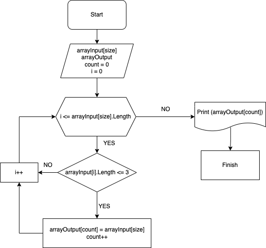

# Final Task
## Задача : 
### Написать программу, которая из имеющегося массива строк формирует массив из строк, длина которых меньше либо равна 3 символа. Первоначальный массив можно ввести с клавиатуры, либо задать на старте выполнения алгоритма. При решении не рекомендуется пользоваться коллекциями, лучше обойтись исключительно массивами

## Описание алгоритма решения:
1. На старте выполнения алгоритма задаем исходный массив данных, в которых используем заранее заготовленные данные.
2. Перебираем все данные из массива до его конца. 
3.	Проверяем подходят ли входящие данные для условий нашего задания.

- 3.1. При положительном результате, берем данные для дальнейших действий. 
- 3.2. При отрицательном результате переходим к другому индексу.
4.	В момент полного прохода до конца массива, выводим результаты, которые удовлетворяют заданные условия.

# Структурная схема алгоритма для основной содержательной части решения:

